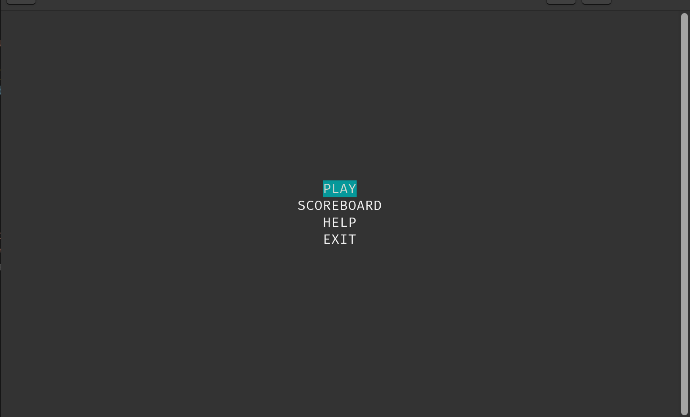
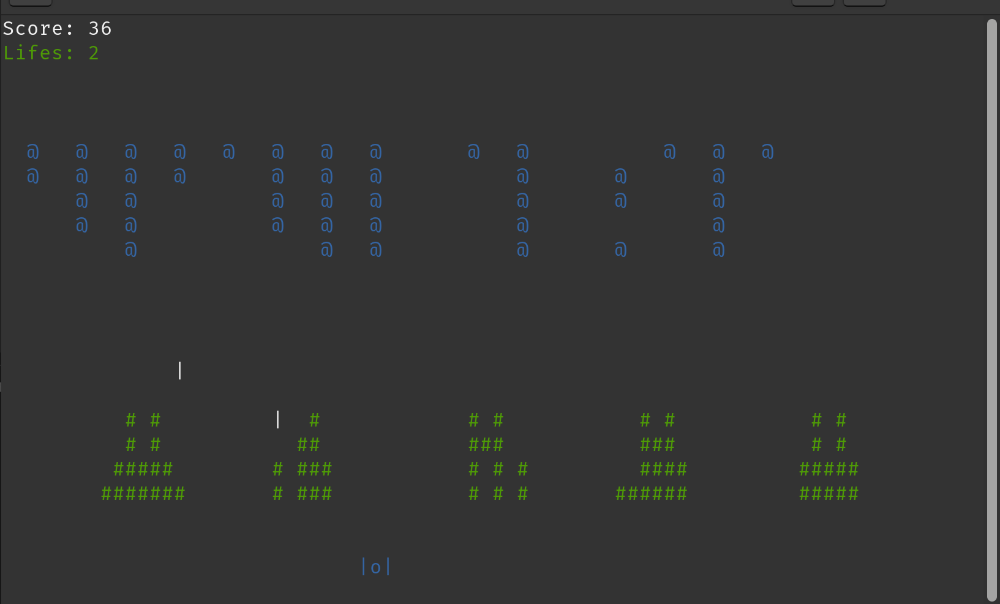
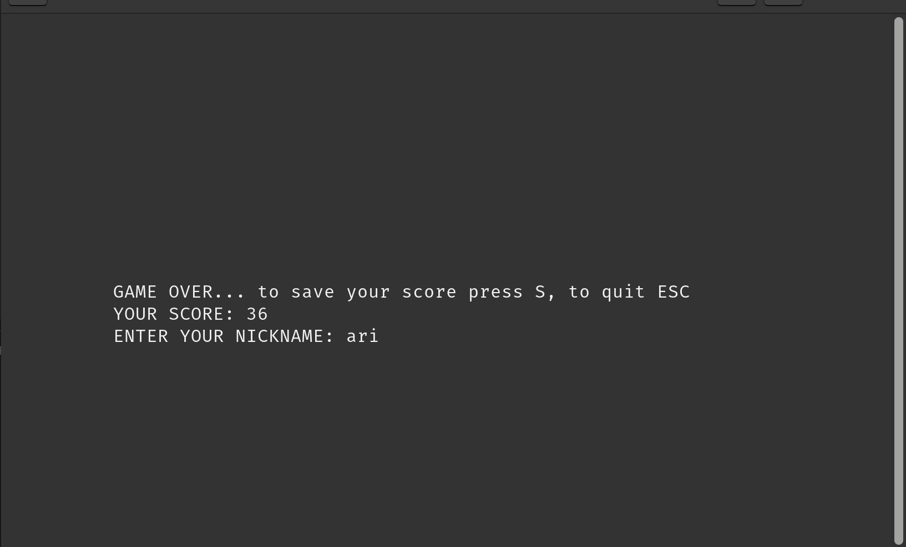
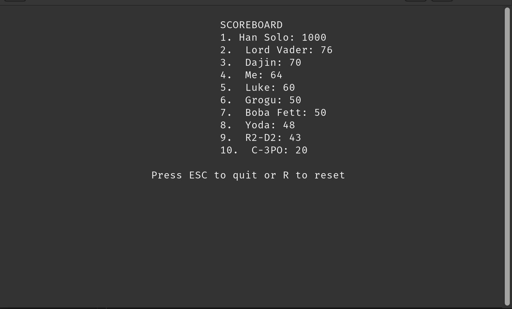

# Space Invaders

This project was created in order to pass programming course in the first semester of Computer Sience studies.

## Screenshots from game:

### Menu

### Gameplay

### Gameover

### Scoreboard

## MANUAL

This game is created for linux terminals with default size:
80x24 (width x heigth).

In diffrent size of terminals game could not work correctly.
For correct working this files are needed:
main.py; classes.py; game.py; screen_logic.py; model_io.py
readme.txt; scoreboard.csv

To control your your fighter use:
LEFT ARROW - to move left
RIGTH ARROW - to move right
SPACEBAR - to shot
YOU HAVE 3 LIFES (customize may be added in further updates)

Your space ship: |o| - It is factory new tie-fighter

Your mission is to kill all rebeliants: @

Customization was in plans, but time is good plan killer.
Press ESC to quit.